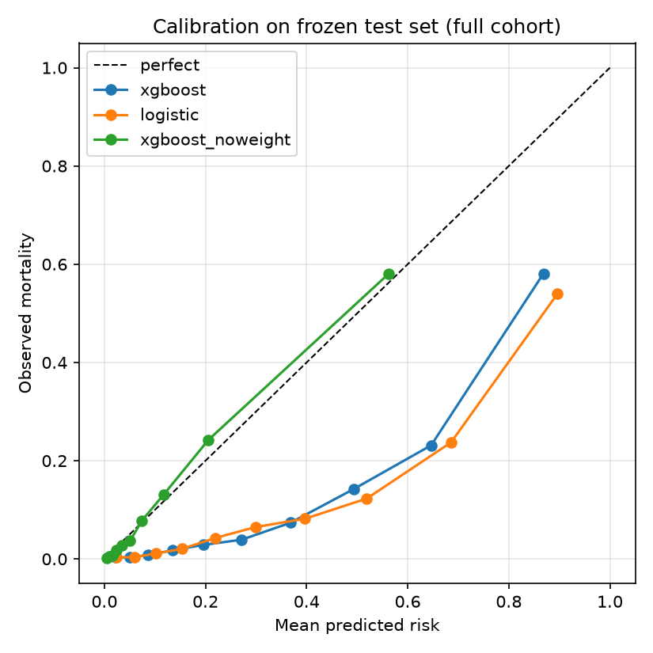

# Clinical Outcome Prediction Platform


An end-to-end clinical machine learning and real-world data analytics project on the **full MIMIC-IV v3.1 Clinical Database** (85,242 first ICU stays, PhysioNet credentialed access).

The current implementation predicts **in-hospital mortality using information available during the first 24 hours after ICU admission**, with emphasis on patient-level data splitting, leakage prevention, honest uncertainty reporting, model calibration, explainability, threshold analysis, and reusable machine learning code.

> **Important:** This project is for research, education, and portfolio demonstration only. It is not intended for clinical use.

---

## Project Overview

Electronic health records contain structured information such as demographics, laboratory measurements, vital signs, admission characteristics, and ICU encounter data that can be used to develop clinical risk prediction models.

This project implements a reproducible machine learning workflow for ICU outcome prediction using MIMIC-IV. It was first built and validated on the 100-patient MIMIC-IV demo, then rerun on the full cohort — and several modelling decisions made on the demo reversed once real sample sizes were available (see [Results](#current-results-full-mimic-iv-v31-cohort)).

The current version covers:

- ICU cohort construction (SQL on BigQuery, reproducible extraction script)
- first-24-hour feature engineering
- leakage-safe patient-level splitting
- preprocessing pipelines
- baseline and tree-based machine learning models
- repeated patient-grouped cross-validation for model comparison
- bootstrap confidence intervals on every reported metric
- probability calibration
- frozen test-set evaluation
- SHAP interpretation
- threshold and clinical utility analysis
- false-positive and false-negative review
- subgroup analysis
- survival analysis (Kaplan–Meier, log-rank, Cox)
- reusable `src/` modules with automated `pytest` coverage and GitHub Actions CI

---

## Clinical Question

> Can structured clinical information available during the first 24 hours after ICU admission be used to estimate the probability of in-hospital mortality?

### Prediction target

```text
hospital_expire_flag

0 = survived hospitalization
1 = died during hospitalization
```

### Prediction timeline

```text
ICU admission
     ↓
First 24 hours of clinical data
     ↓
Prediction time
     ↓
In-hospital outcome
```

Only information available within the defined prediction window is used as model input.

---

## Dataset

### MIMIC-IV v3.1 (PhysioNet, credentialed access)

- `hosp` and `icu` modules, queried through Google BigQuery (`physionet-data.mimiciv_3_1_*`)
- MIT-LCP derived tables (`mimiciv_3_1_derived`) for first-24h vitals and labs
- Cohort: adults (≥18), first ICU stay per hospital admission
- **85,242 ICU stays, 9,475 in-hospital deaths (11.1%)**

Core data sources:

- patient demographics
- hospital admissions
- ICU stays and care-unit information
- laboratory measurements (chemistry, CBC, blood gas, enzymes)
- vital signs

### Data access

MIMIC-IV is a credentialed dataset. Raw data, extracted cohorts, and any patient-level outputs are excluded from version control (`data/`, `results/predictions/`, `results/explanations/`, `results/analysis/*.csv`). To reproduce:

1. Obtain PhysioNet credentialed access to MIMIC-IV v3.1 and link a Google account for BigQuery.
2. `gcloud auth application-default login`
3. `python src/data/extract_bigquery.py` — runs `sql/05_full_cohort_bigquery.sql` and writes `data/raw/full/modeling_cohort_full.csv`.

The original 100-patient demo build (`sql/01–04`, notebooks 01–10) is retained for reference.

---

## Cohort Construction

The modeling cohort is constructed at the ICU-stay level.

Key cohort design decisions:

- retain the first ICU stay for each hospital admission; adults only;
- one modeling observation per ICU stay;
- preserve `subject_id`, `hadm_id`, and `stay_id` for validation and leakage control;
- first-24-hour feature window (labs drawn up to 6 h before ICU admission are treated as admission baseline, following MIMIC convention);
- exclude post-prediction information from model predictors;
- maintain patient-level independence across training pool and test set.

Cohort and features are built in a single BigQuery SQL (`sql/05_full_cohort_bigquery.sql`): four CTEs for cohort definition and first-value labs, joined to the derived first-day vitals/labs tables.

---

## Machine Learning Workflow

```text
MIMIC-IV v3.1 (BigQuery)
        │
        ▼
SQL Cohort + Feature Extraction  →  data/raw/full/modeling_cohort_full.csv
        │
        ▼
Data Validation
        │
        ▼
Patient-Level 80/20 Split  (frozen test_subject_ids.csv)
        │
        ▼
Preprocessing Pipeline
        │
        ├── Missing-value imputation
        ├── Missingness indicators
        ├── Standardization
        └── One-hot encoding
        │
        ▼
Model Comparison — repeated StratifiedGroupKFold on training pool
        │
        ├── Logistic Regression
        ├── Random Forest
        └── XGBoost
        │
        ▼
Frozen Test Evaluation — bootstrap 95% CIs
        │
        ▼
Calibration check
        │
        ▼
SHAP Interpretation
        │
        ▼
Threshold / Clinical Utility / Error / Subgroup Analysis
        │
        ▼
Survival Analysis (KM, log-rank, Cox)
```

---

## Models

| Model | Purpose |
|---|---|
| Dummy Classifier | Reference baseline |
| Logistic Regression | Interpretable linear baseline |
| Random Forest | Nonlinear ensemble model |
| XGBoost | Gradient-boosted tree model (final model) |

The primary model-selection metric is **AUROC across repeated grouped CV folds**, with AUPRC as the secondary discrimination metric and Brier score for probability quality.

---

## Current Results (full MIMIC-IV v3.1 cohort)

All numbers below come from the full cohort. Patients were split 80/20 at the `subject_id` level with a fixed seed; the 20% test set was frozen before any model was fitted and evaluated exactly once (notebook 08b). Confidence intervals are 95% percentile bootstrap (1,000 resamples of the test set).

### Model comparison — repeated patient-grouped cross-validation (notebook 07b)

2 repeats × 3 folds of `StratifiedGroupKFold` on the 80% training pool (68,168 stays, 7,548 deaths). Values are mean ± SD across folds.

| Model | AUROC | AUPRC |
|---|---:|---:|
| XGBoost | **0.891 ± 0.004** | **0.599 ± 0.010** |
| Logistic Regression | 0.868 ± 0.005 | 0.542 ± 0.011 |
| Random Forest | 0.855 ± 0.006 | 0.515 ± 0.012 |

XGBoost leads by ~0.02 AUROC — roughly 5× the fold-to-fold SD, and the percentile ranges of the three models do not overlap. The gap is real, not split noise.

### Final test performance (notebook 08b)

| Model | AUROC (95% CI) | AUPRC (95% CI) | Brier (95% CI) |
|---|---:|---:|---:|
| **XGBoost, unweighted (final)** | **0.892 (0.884–0.899)** | **0.617 (0.596–0.637)** | **0.066 (0.063–0.068)** |
| XGBoost, scale_pos_weight ≈ 8 | 0.890 (0.883–0.897) | 0.609 (0.589–0.630) | 0.125 (0.123–0.128) |
| Logistic Regression, class-weighted | 0.869 (0.860–0.876) | 0.546 (0.524–0.569) | 0.143 (0.140–0.146) |

Test AUROC falls inside the cross-validation range, confirming the CV estimate was honest. For reference, the constant-rate baseline (predict 0.111 for everyone) has Brier ≈ 0.098.

### Class weighting: a demo-era decision revisited

Class re-weighting (`scale_pos_weight ≈ 8` for XGBoost, `class_weight="balanced"` for logistic regression) was introduced when the development set had 11 deaths. On the full cohort it was tested explicitly:

- **Discrimination:** unchanged (AUROC 0.890 → 0.892).
- **Calibration:** badly harmed. The weighted model over-predicts risk everywhere — top decile predicted 0.87 vs observed 0.58 — and its Brier score (0.125) is worse than the constant-rate baseline. The unweighted model sits on the diagonal (Brier 0.066).



With ~7,500 events the model learns the minority class without help. Weighting was dropped; the final model is the unweighted XGBoost.

### What changed from the demo build

| | Demo (100 patients) | Full cohort |
|---|---|---|
| Test set | 19 stays, 2 deaths | 17,074 stays, 1,927 deaths |
| Best model | Random Forest (val AUROC 0.944, test 0.647) | XGBoost (test AUROC 0.892, CI ±0.007) |
| Model ranking | RF > LR | XGB > LR > RF |
| Class weighting | Required | Harmful — removed |
| Post-hoc calibration | Isotonic over-fit on 2 positives | Not needed (unweighted model already calibrated) |

The demo result "Random Forest wins" was split noise on two positive cases. Every modelling decision made on 89 training rows was re-examined once the full data was available, and two of them (model choice, class weighting) reversed. This is the central lesson of the project.

---

## Evaluation Metrics

### Discrimination

- AUROC, AUPRC — each with 95% bootstrap CI

### Threshold-based classification

- Accuracy, Precision / PPV, Recall / Sensitivity, Specificity, NPV, F1
- Confusion-matrix counts

### Probability quality

- Brier Score, Log Loss
- Calibration curves (quantile bins)
- Mean predicted risk vs observed event rate

### Clinical operating characteristics

- probability-threshold trade-offs
- number of patients flagged, false-positive / false-negative burden
- review-capacity analysis and death-capture rate

### Uncertainty (`src/evaluation/resampling.py`)

- `bootstrap_metric_ci` — percentile bootstrap CI for any `(y_true, y_prob) → float` metric
- `repeated_grouped_cv` — repeated `StratifiedGroupKFold` with per-fold metrics
- paired per-fold model differences

---

## Probability Calibration

Calibration is assessed on the frozen test set with quantile-binned reliability curves and Brier score.

Sigmoid and isotonic post-hoc calibration (`src/models/calibration.py`) remain available; they are not applied to the final model because the unweighted XGBoost is already well calibrated.

---

## Explainable AI

SHAP is used to examine model behavior at both global and patient-specific levels:

- mean absolute SHAP feature importance
- SHAP summary / beeswarm and dependence plots
- patient-level waterfall plots
- comparison with tree-model built-in importance

SHAP values are interpreted as **predictive contributions**, not causal effects. Full-cohort SHAP analysis is scheduled for the next iteration (notebook 09 currently reflects the demo build).

---

## Threshold and Clinical Utility Analysis

A clinical prediction system requires a probability threshold to convert predicted risk into an actionable classification. The project evaluates multiple thresholds and examines the trade-off:

```text
Lower threshold → higher sensitivity → fewer missed deaths → more false alerts → higher review burden
Higher threshold → lower alert burden → higher specificity → more missed deaths
```

Thresholds are chosen on the training pool, never on the test set. Operating points should ultimately be set by clinical review capacity rather than by a statistical optimum.

---

## Error Analysis

**False negatives** — deaths predicted below the operating threshold — are reviewed for predicted probability, distance from threshold, demographics, ICU characteristics, and available features.

**False positives** — high-risk survivors — are also reviewed. A false positive does not imply the patient was low-risk: they may have been severely ill and survived after treatment.

---

## Subgroup Analysis

Exploratory subgroup analyses by sex, age group, race, insurance, ICU care unit, and admission type. Subgroup estimates are reported with sample and event counts; these analyses do **not** establish model fairness or subgroup-specific clinical validity.

---

## Survival Analysis (notebook 11)

Time-to-event analysis on the cohort using `lifelines`:

- Kaplan–Meier curves overall and by age group / sex
- log-rank tests
- Cox proportional hazards with hazard-ratio forest plot
- subgroup summaries by admission type and care unit

Currently on the demo cohort; full-cohort rerun with IPTW-weighted Cox is planned (see [Planned Extensions](#planned-extensions)).

---

## Software Engineering

Reusable implementation code is separated from exploratory notebooks.

```text
src/
├── config.py
├── data/          loaders.py, validation.py, extract_bigquery.py
├── features/      preprocessing.py
├── models/        logistic.py, random_forest.py, xgboost_model.py, calibration.py
├── evaluation/    metrics.py, resampling.py, plots.py, threshold.py, subgroup.py
├── interpretation/ shap_utils.py, feature_importance.py
└── survival/      Kaplan–Meier, log-rank, Cox helpers
```

```text
notebooks/  → experiments, analysis, plots, interpretation
src/        → reusable implementation
sql/        → cohort and feature extraction (01–04 demo/DuckDB, 05 full/BigQuery)
tests/      → automated validation
results/    → aggregate tables and figures (patient-level outputs git-ignored)
```

Engineering practices:

- feature-branch workflow with pull requests; GitHub Actions runs the test suite on every PR
- `requirements.txt` (top-level deps) + `requirements.lock` (pinned versions)
- `.dockerignore` and `.gitignore` configured to keep credentialed data and model binaries out of git and images
- notebooks committed with outputs cleared

---

## Repository Structure

```text
clinical-outcome-prediction/
├── .github/workflows/tests.yml
├── data/                 (git-ignored; README only)
├── notebooks/
├── sql/
├── src/
├── tests/
├── models/               (config JSON tracked; .joblib git-ignored)
├── results/
│   ├── tables/
│   └── figures/
├── reports/
├── app/
├── requirements.txt
├── requirements.lock
├── .dockerignore
├── .gitignore
└── README.md
```

---

## Testing

```bash
python -m pytest -v
```

The suite covers cohort integrity, patient-level split leakage, preprocessing with missing and unknown values, each model pipeline, discrimination and probability metrics, threshold and review-capacity analysis, subgroup analysis, bootstrap CI behaviour (reproducibility, CI narrowing with n, single-class resamples), and repeated grouped CV (no patient split across folds).

Current status: **30 passed** on Python 3.12 (CI) and 3.14 (local).

---

## Installation

```bash
git clone https://github.com/Yaoyao28/clinical-outcome-prediction.git
cd clinical-outcome-prediction
python -m venv .venv
# Windows: .\.venv\Scripts\Activate.ps1   |   macOS/Linux: source .venv/bin/activate
pip install -r requirements.lock
python -m pytest -v
```

To pull the full cohort you additionally need PhysioNet credentials and `gcloud` (see [Data access](#data-access)).

---

## Core Dependencies

```text
numpy, pandas, scipy
scikit-learn, xgboost
shap
lifelines
matplotlib
duckdb
google-cloud-bigquery, db-dtypes
joblib
jupyter, ipykernel
pytest
```

---

## Project Status

### Completed

- full MIMIC-IV v3.1 cohort extraction (BigQuery SQL + script)
- data validation and patient-level frozen split
- preprocessing pipeline
- Logistic Regression, Random Forest, XGBoost
- repeated patient-grouped cross-validation model comparison
- frozen test evaluation with bootstrap CIs
- class-weighting ablation and calibration assessment
- survival analysis notebook (demo cohort)
- reusable `src/` package, 30 automated tests, GitHub Actions CI

### In progress

- rerun of notebooks 03–10 (SHAP, thresholds, subgroups, error analysis) on the full cohort
- Random Forest re-tuning for the full cohort
- severity-score baselines (SOFA / SAPS-II) from `mimiciv_3_1_derived`

---

## Planned Extensions

### Real-World Evidence / Trial Analytics

- trial-style cohort builder: inclusion/exclusion, index date, baseline and follow-up windows, attrition diagram (notebook 12)
- propensity score estimation, matching, IPTW, AIPW; overlap and SMD / Love-plot diagnostics; sensitivity analysis (notebook 13)
- IPTW-weighted Cox on the full cohort (notebook 11 upgrade)

### Machine Learning

- temporal validation using `anchor_year_group`
- distribution-shift / OOD detection and selective prediction (notebook 14)
- PyTorch MLP baseline

### Deployment

- FastAPI prediction service + Docker image
- MLflow experiment tracking and model registry
- CI/CD and cloud deployment

---

## Limitations

The full MIMIC-IV v3.1 cohort resolves the sample-size problems of the original demo build, but several limitations remain:

- **Single-centre data.** All patients come from one health system (BIDMC, Boston). Performance on other hospitals, countries, or care systems is unknown; there is no external validation.
- **Internal evaluation only.** The frozen test set is a random 20% of patients from the same distribution. Temporal drift (MIMIC-IV spans 2008–2019) has not been assessed.
- **Random Forest is under-tuned on the full cohort.** Its hyper-parameters (max_depth = 8, min_samples_leaf = 5) were chosen for the 89-row demo and are the likely reason it now trails logistic regression. A re-tune is planned before the final model comparison.
- **Feature set is deliberately simple.** First-24h vitals and common labs only; no medications, procedures, ventilation status, or free text. Established severity scores (SOFA, APACHE) are not yet included as baselines.
- **Post-hoc calibration not re-run.** The unweighted XGBoost is already well calibrated (Brier 0.066, curve on the diagonal), so the demo-era calibration step was not repeated; it remains available if a different final model is chosen.
- **Downstream notebooks (09–11) still reflect the demo build** until the full-cohort rerun is complete.
- **Predictive, not causal.** SHAP values and coefficients describe associations in this population and must not be read as treatment effects.

The model and analysis are intended for research, education, and portfolio demonstration only.

**This project is not intended for clinical use.**

---

## Reproducibility

```text
src/data/extract_bigquery.py     → data/raw/full/modeling_cohort_full.csv
        ↓
03b  Full-cohort sanity check
        ↓
07b  Repeated grouped CV model comparison   (writes test_subject_ids.csv)
        ↓
08b  Frozen test evaluation + bootstrap CIs + calibration
        ↓
09–10  SHAP, thresholds, subgroups, errors   (full-cohort rerun in progress)
        ↓
11   Survival analysis
```

Before publishing a release, all notebooks should be restarted and rerun from a clean kernel with outputs cleared, and the complete test suite should pass.

---

## Future Project Direction

The long-term goal is to evolve this repository from an ICU mortality prediction project into a broader:

> **Real-World Clinical Outcome Prediction and Treatment Effect Analysis Platform**

The predictive modeling workflow serves as the foundation for survival analysis, trial-style cohort construction, and observational causal inference using MIMIC-IV.
